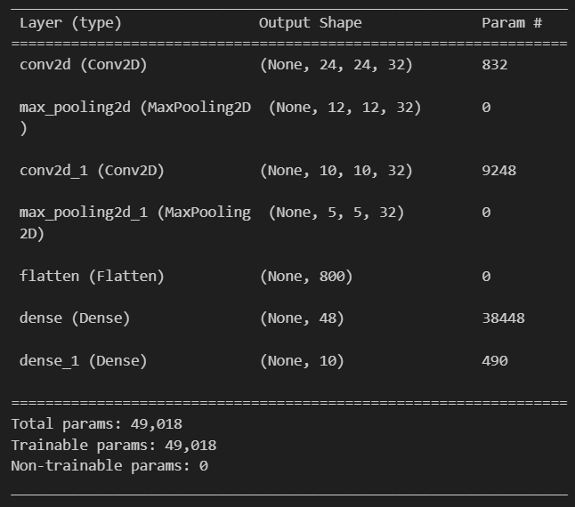
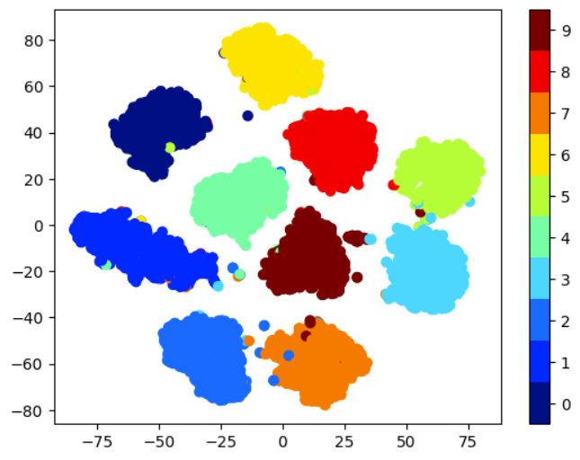
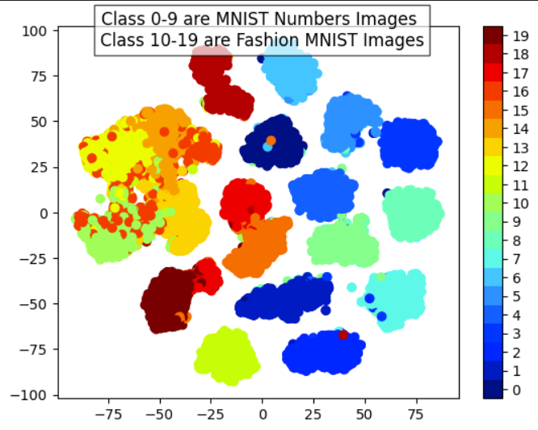

<h2>Task-2</h2>

We needed to create a CNN model from scratch in this task. Later we also needed to add dropout in the model and compare the accuracies as well as predict the uncertainity. We also needed to create tsne plots for the outputs of our models.

------

We start of by creating a CNN model with the following architecture:

Convolution-Pooling-Convolution-Pooling-FCC-Output

We tune the hyperparameters of this CNN architecture using kerastuner. We get the following hyperparameters that result in the best accuracy:

`The testing accuracy for model without MC dropout came out : 0.9889000058174133`

Now, we add MC dropout in the given model at each layer with a dropout probability of 0.4 .

We then run the model 100 times for each test image and we output the average as the final prediction. 

`The testing accuracy for model with MC dropout came out (by taking an average of 100 iterations): 0.9917`  

-----

<h3>Part a)</h3>

In this part we needed to, remove the final layer for the  Non-MC dropout model and plot TSNE plot from the fitted model's outputs.

The resulting TSNE plot:

----
<h3>Part b)</h3>

In this part we need to predict certain images in the Fashion MNIST dataset using our model with MC dropout. We need to give the testing accuracy as well as the uncertainity.

Here, to calculate the uncertainity, I used 2 measures: 

The variance of result for each test image across 100 predictions and Predictive entropy.

Here Predictive entroy is average of sum of `(-probability*log(probability))` across all 10 classes for 100 iterations.

For this subtask, I firstly predicted on the model that was only trained on MNIST dataset, and not on the Fashion MNIST dataset.

The results:

`The average variance for each prediction(a form of uncertainity) : [0.26300514 0.24211177 0.2269969  ... 0.16625433 0.23489672 0.14443341]`

`The uncertainity(entropy) for each prediction : [0.34840667 0.581479   0.7054053  ... 1.2388569  0.62063754 1.5187188 ]`

`Average Uncertainty across the tests(standard deviation of predictive entropy): 0.99848723`

`Accuracy of the model : 0.1056`

We can see that the Average Uncertainity is very high and the Accuracy is very low for this model.

Now, we train the model on the Fashion MNIST dataset. The results for this:

`The average variance for each prediction(a form of uncertainity) : [0.29707313 0.2908978  0.29998198 ... 0.2984008  0.29931396 0.22707577]`

`The uncertainity(entropy) for each prediction : [0.03247189 0.         0.         ... 0.01999399 0.         0.67041624]`

`Average Uncertainty across the tests(standard deviation of predictive entropy): 0.2529331`

`Accuracy of the model : 0.9019`

Here we can see that the Accuracy has increased significantly and the uncertainity has also decreased as the model is now more confident.

---

<h3>Part c)</h3>

For this part we need to repeat Part a) but now for MNIST as well as the Fashion MNIST data. We need to observe if we see any pattern.

As we need to combine the data, I labeled the images of Fashion MNIST dataset from 10 to 19 and I kept the labels for Number MNIST dataset from 0 to 9 only. This way I can plot all the different kinds of images in the same plot.

I trained the Non-MC model on both the datasets and then plotted the following TSNE plot:

Here we can clearly see a pattern that the points labeled from 10-19 are on the left hand side (Fashion MNIST Images) and the points labeled from 0-9 are on the right hand side (MNIST Images). This shows that there is a clear distinct between how the model operates on these different datasets.  

---